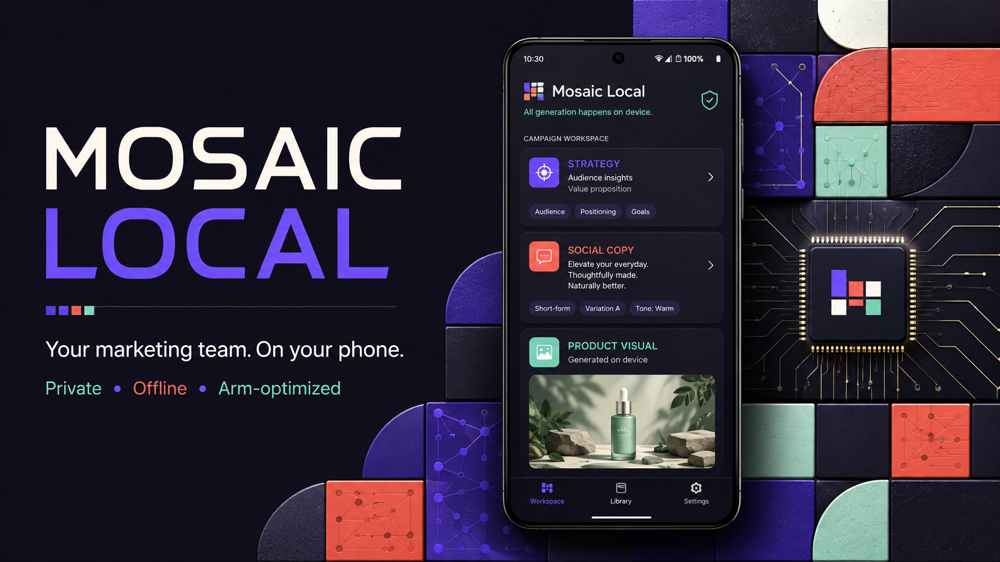

#  Mosaic Local



**A complete, private AI marketing team running on an Arm64 Android phone.**

Mosaic Local is the on-device rebuild of Mosaic Marketing. It transforms a
brand profile into campaign strategy, finished copy, calls to action,
hashtags, and Caribbean-aware visual direction without cloud inference.

## Features

- Private brand onboarding
- Three-stage awareness → consideration → conversion campaigns
- Local strategist, copywriter, visual director, and brand guardian roles
- On-device 512×512 image generation with `stable-diffusion.cpp`
- Streaming inference
- Versioned approvals stored on the device
- In-app Arm performance metrics
- Offline operation after one-time model installation

## Architecture

```text
Flutter UI
  ├─ Brand manifest + local campaign store
  ├─ Deterministic Mosaic orchestrator
  │    ├─ Strategist prompt
  │    ├─ Copywriter prompt
  │    ├─ Visual director prompt
  │    └─ Brand guardian contract
  └─ LiteRT-LM
       └─ Gemma 3 1B IT INT4
            └─ Arm64 GPU / optimized CPU fallback

Creative Engine
  └─ Llamatik Android bridge
       └─ stable-diffusion.cpp
            └─ SD-Turbo GGUF → local PNG
```

All roles share one model. This preserves the multi-agent product experience
without duplicating hundreds of megabytes of weights.

## Requirements

- Flutter stable compatible with Dart 3.3+
- Android SDK and a physical 64-bit Arm Android device
- A Gemma 3 1B IT INT4 `.litertlm` model URL
- An SD-Turbo or compatible self-contained diffusion GGUF (about 2 GB)
- Hugging Face token if the selected model repository is gated

## Build

If Gradle wrapper or launcher assets are missing after cloning, let Flutter
regenerate platform boilerplate without replacing `lib/`:

```bash
flutter create --platforms android --org gy.onetech .
flutter pub get
flutter test
flutter run --release
```

Reapply the following if `flutter create` replaces Android configuration:

- `ndk { abiFilters "arm64-v8a" }` in `android/app/build.gradle`
- the four `uses-native-library` declarations in `AndroidManifest.xml`
- `minSdk = 26`

Build the submission APK:

```bash
flutter build apk --release --target-platform android-arm64
```

## Run offline

1. Open the Model tab.
2. Enter the direct `.litertlm` URL and optional gated-model token.
3. Install once.
4. Enable airplane mode.
5. Create a brand and generate a campaign.
6. Open Creative, install the visual model, select a campaign direction, and
   generate the image with airplane mode still enabled.

The token is used only by the model downloader and is not stored by Mosaic.
The application does not call Gemini, Google Search, Imagen, or any Mosaic
server.

The application unloads Gemma before loading Stable Diffusion, generates one
image, releases the diffusion model, and restores Gemma. This prevents two
large weight sets from competing for mobile memory.

The default SD-Turbo model is distributed under Stability AI's applicable
community license. Review its model card and license before commercial use.

## Verification

See [ARM_OPTIMIZATION.md](ARM_OPTIMIZATION.md) for the repeatable device
benchmark protocol and [DEVPOST.md](DEVPOST.md) for submission copy.

## License

MIT

See [THIRD_PARTY_NOTICES.md](THIRD_PARTY_NOTICES.md) for runtime and model
licenses.
